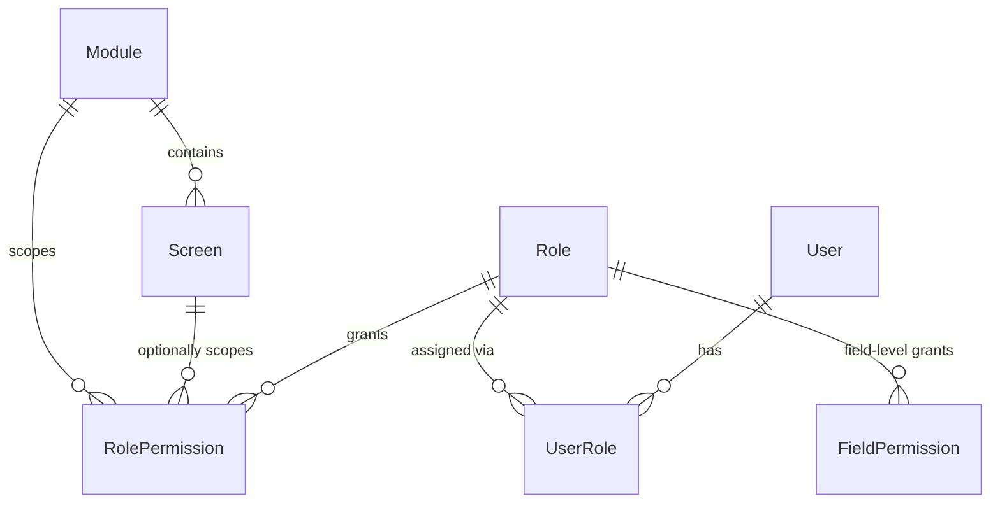
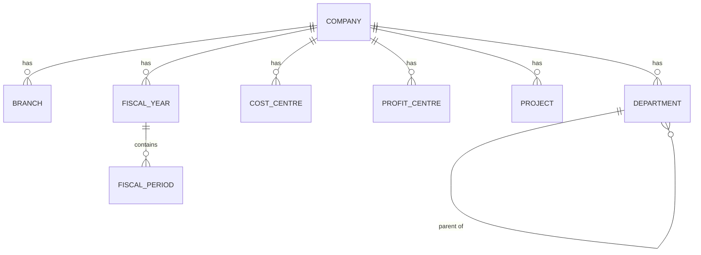
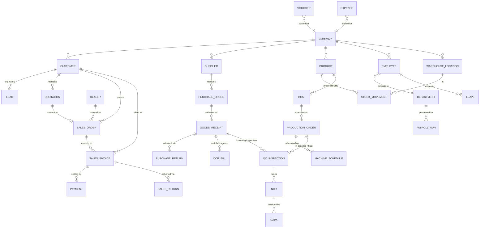

# GreenFlow ERP — Backend API Documentation

Version 0.1 (Phase A) · Base URL `/api/v1/`

This documents the API **as actually implemented** in this Django backend today. It is the
counterpart to `eco-craft-flow/API_DOCS.md`, which documents the API the *frontend expects*
once every module is built. See [§6](#6-frontend-integration-mapping) for how the two reconcile.

---

## 1. Conventions

- Base URL: `/api/v1/`
- Auth: `Authorization: Bearer <JWT access token>` on every endpoint except `login`/`refresh`.
- Content type: `application/json` (file uploads, e.g. `Company.logo`, use `multipart/form-data`).
- Identifiers: UUID v4 strings in `id`.
- Dates: ISO-8601 `YYYY-MM-DD`, Gregorian. BS (Bikram Sambat) equivalents are exposed as
  additional read-only fields where relevant (e.g. `FiscalYear.start_date_bs`), never as the
  canonical date.
- Pagination: `?page=&page_size=` (max `page_size=200`, default 25) — see envelope shape below.
- Filtering/search/ordering: `?search=`, `?ordering=`, plus per-resource `filterset_fields`
  listed under each resource below.
- OpenAPI schema is generated automatically (`drf-spectacular`) from the real serializers/views —
  `/api/schema/`, `/api/docs/` (Swagger), `/api/redoc/`. If this document and the live schema
  ever disagree, the live schema is authoritative.

---

## 2. Response envelope

**This backend uses a different, more structured envelope than the raw DRF shape originally
documented in `eco-craft-flow/API_DOCS.md`.** This is a deliberate Phase A decision (consistent
machine-readable error codes for business-rule failures like `PERIOD_CLOSED`,
`INSUFFICIENT_STOCK`, etc.) and needs to be accounted for when the frontend's `apiFetch` wrapper
is eventually pointed at real endpoints.

### Success

```json
{
  "data": { "...": "the resource or list of resources" },
  "meta": {}
}
```

Paginated list responses (`EnvelopePageNumberPagination`) populate `meta` with:

```json
{
  "data": [ ... ],
  "meta": {
    "count": 42,
    "page": 1,
    "page_size": 25,
    "num_pages": 2,
    "next": "http://.../api/v1/organization/companies/?page=2",
    "previous": null
  }
}
```

### Error

```json
{
  "error": {
    "code": "PERIOD_CLOSED",
    "message": "Fiscal period 'Shrawan 2082' is closed for posting.",
    "fields": {}
  }
}
```

Validation errors populate `fields` with the same per-field structure DRF normally returns
(`{"email": ["This field is required."]}`), just nested under `error.fields` instead of at the
response root. `code` is one of a stable set of machine-readable strings (see
[§5 Error codes](#5-error-codes)) — always prefer switching on `error.code`, not
`error.message`, in frontend error handling.

**Reconciliation note:** the frontend's `src/services/api/client.ts` scaffold currently expects
raw JSON `T` (i.e. `res.json()` cast directly to the resource type) and does not unwrap `data`/
`error`. That client will need a small update (unwrap `json.data` on success, throw using
`json.error.code`/`message` on failure) when it is actually connected — this is a frontend
change the user has asked to defer until a module is ready to go live, not something to silently
work around on the backend.

---

## 3. Implemented endpoints (Phase A)

Everything below exists today with real models, serializers, permissions and tests. Endpoints
not listed here (sales, CRM, inventory, production, accounting, etc.) do not exist yet — calling
them will 404.

### 3.1 Auth — `apps.accounts` (`module_code` not applicable; auth endpoints are `AllowAny`/`IsAuthenticated` only)

| Method | Path | Purpose | Auth |
|---|---|---|---|
| POST | `/api/v1/auth/login/` | Obtain access + refresh JWT. Body: `{ "email", "password" }`. Response `data` includes `access`, `refresh`, `user` (see `UserSummarySerializer`). Locks account after repeated failures. | AllowAny (throttled: `login` scope) |
| POST | `/api/v1/auth/refresh/` | Rotate a refresh token for a new access/refresh pair. Body: `{ "refresh" }`. Old refresh token is blacklisted. | AllowAny |
| POST | `/api/v1/auth/logout/` | Blacklist a specific refresh token. Body: `{ "refresh" }`. | IsAuthenticated |
| GET | `/api/v1/auth/me/` | Current user profile + roles. | IsAuthenticated |
| POST | `/api/v1/auth/change-password/` | Body: `{ "old_password", "new_password" }`. Blacklists **all** outstanding tokens for the user (forces re-login everywhere). | IsAuthenticated (throttled: `sensitive` scope) |

**`UserSummarySerializer` fields:** `id`, `email`, `first_name`, `last_name`, `full_name`,
`phone`, `is_superuser`, `is_staff`, `must_change_password`, `roles` (list of active role codes).

### 3.2 Organization — `apps.organization` (`module_code = "organization"`)

Standard CRUD (list/create/retrieve/update/delete) on every resource below, under
`/api/v1/organization/`. All require `HasModulePermission` for the `organization` module.

| Resource | Path | Key fields | Notes |
|---|---|---|---|
| Company | `companies/` | `name`, `legal_name`, `pan_vat_number`, `address`, `base_currency`, `logo` | One or more per deployment |
| Branch | `branches/` | `company`, `code`, `name`, `address`, `is_head_office` | Unique per `(company, code)` |
| Department | `departments/` | `company`, `code`, `name`, `parent` | Self-referential hierarchy |
| Cost Centre | `cost-centres/` | `company`, `code`, `name` | |
| Profit Centre | `profit-centres/` | `company`, `code`, `name` | |
| Project | `projects/` | `company`, `code`, `name`, `start_date`, `end_date` | |
| Fiscal Year | `fiscal-years/` | `company`, `code` (e.g. `"2082-83"`), `start_date`, `end_date`, `status` (`open`/`closed`/`locked`), read-only `start_date_bs`/`end_date_bs` | |
| Fiscal Period | `fiscal-periods/` | `fiscal_year`, `code` (e.g. `"Shrawan"`), `month_number`, `start_date`, `end_date`, `status` | Unique per `(fiscal_year, month_number)` |
| Exchange Rate | `exchange-rates/` | `currency_code`, `rate_to_base`, `as_of_date` | Unique per `(currency_code, as_of_date)` |

`apps.organization.services.assert_period_open(fiscal_period)` is the guard every future
posting-type endpoint (sales invoice, GL journal, payroll run, etc.) must call before writing —
it raises `PeriodClosedError` (`error.code = "PERIOD_CLOSED"`) if either the period or its parent
fiscal year isn't `open`.

### 3.3 Audit — `apps.audit` (`module_code = "audit"`)

| Method | Path | Purpose |
|---|---|---|
| GET | `/api/v1/audit/logs/` | Paginated, filterable audit trail. Read-only — no create/update/delete via API or admin. |
| GET | `/api/v1/audit/logs/{id}/` | Retrieve a single entry. |

Filters: `?module=`, `?model_name=`, `?action=`, `?user=`, `?document_number=`. Search:
`?search=` (document_number, model_name). Ordering: `?ordering=timestamp` / `-timestamp`.

**Fields:** `id`, `timestamp`, `user` (nullable — `null` for anonymous/system actions),
`user_email`, `action` (`create`/`view`/`update`/`delete`/`submit`/`approve`/`reject`/`cancel`/
`post`/`reverse`/`export`/`print`/`login`/`logout`), `module`, `model_name`, `object_id`,
`document_number`, `request_id`, `ip_address`, `user_agent`, `before_data`, `after_data`,
`reason`.

### 3.4 System — `apps.system` (`module_code = "system"`)

| Resource | Path | Key fields |
|---|---|---|
| System Setting | `system/settings/` | `key` (unique slug), `value` (arbitrary JSON), `description` |
| Feature Flag | `system/feature-flags/` | `key` (unique slug), `is_enabled`, `description` |
| Numbering Series Config | `system/numbering-series/` | `document_type` (unique slug, e.g. `"sales_order"`), `prefix`, `padding`, `is_branch_aware`, `is_fiscal_year_aware` |

---

## 4. RBAC model

Permissions are **not** Django's built-in Group/Permission system. The schema (all in
`apps.accounts.models`):



- **Module** — coarse boundary matching a business area, e.g. `sales`, `organization`, `audit`.
  Every ViewSet declares `module_code = "<module>"`.
- **Screen** *(optional)* — finer-grained sub-resource inside a module, e.g. `sales.orders`. A
  `RolePermission` with `screen=null` grants the action across the whole module.
- **Action** — one of `view`, `create`, `edit`, `delete`, `submit`, `approve`, `reject`,
  `cancel`, `post`, `reverse`, `export`, `print`, `view_sensitive`.
- **Role** — named bundle of permissions (`administrator`, `manager`, `sales`, `purchase`,
  `warehouse`, `production`, `hr`, `quality_control`, `viewer` are seeded by `seed_demo`).
- **UserRole** — assigns a role to a user, optionally scoped to one branch.
- **FieldPermission** — per-role, per-module, per-field `can_view`/`can_edit` override (used to
  hide sensitive fields like payroll `basic` salary from roles that shouldn't see them).

**Enforcement:** `apps.accounts.permissions.HasModulePermission` maps the HTTP method to an
`Action` (`GET`→`view`, `POST`→`create`, `PUT`/`PATCH`→`edit`, `DELETE`→`delete`) and checks
`apps.accounts.rbac.user_has_permission(user, module_code, action, screen_code)`. Superusers
bypass RBAC entirely. **Any view that does not declare `module_code` fails closed** (denies
everyone but superusers) rather than silently allowing access.

Workflow-style actions (custom `@action` endpoints like `submit`/`approve` that don't map
cleanly to a REST verb) should use `HasActionPermission` with an `action_permission_map` on the
view instead.

---

## 5. Error codes

| `error.code` | HTTP status | Meaning |
|---|---|---|
| `INSUFFICIENT_STOCK` | 400 | Attempted to reserve/issue more stock than available |
| `CREDIT_LIMIT_EXCEEDED` | 400 | Sales document would exceed the customer's credit limit |
| `PERIOD_CLOSED` | 400 | Target fiscal period (or its fiscal year) is not open |
| `APPROVAL_REQUIRED` | 400 | Document requires approval before this transition |
| `INVALID_STATUS_TRANSITION` | 400 | Requested document status change isn't a legal transition |
| `THREE_WAY_MATCH_FAILED` | 400 | PO / GRN / Invoice quantities or amounts don't reconcile |
| `PAYMENT_EXCEEDS_OUTSTANDING` | 400 | Payment amount exceeds the invoice's outstanding balance |
| `DEBIT_CREDIT_MISMATCH` | 400 | Journal entry debits ≠ credits |
| `PERMISSION_DENIED` | 403 | RBAC check failed |
| `INVALID_TOKEN` | 400/401 | JWT invalid, expired, or already blacklisted |
| `account_locked` | 400 | Login blocked by account lockout policy |
| `INTERNAL_ERROR` | 500 | Unhandled server error — never leaks a traceback to the client |

All other DRF-native validation failures (missing required field, wrong type, etc.) surface with
DRF's default codes (e.g. `required`, `invalid`) inside `error.fields`.

---

## 6. Frontend integration mapping

`eco-craft-flow/API_DOCS.md` documents the full target API surface (CRM, Sales, Procurement,
Inventory, Production, Quality, etc.) that the frontend's form schemas already assume. Status of
each against what's actually live in this backend:

| Frontend-documented endpoint | Backend status |
|---|---|
| `POST /api/v1/auth/login/`, `/auth/refresh/`, `/auth/logout/` | **Implemented**, same paths |
| `/auth/password-reset/`, `/auth/password-reset/confirm/` | Not implemented (Phase B+) |
| `/api/v1/crm/customers/`, `/crm/leads/`, `/crm/quotations/`, `/crm/dealers/` | Not implemented — `apps.crm` is an empty scaffold |
| `/api/v1/sales/orders/`, `/sales/invoices/`, `/sales/payments/`, `/sales/returns/` | Not implemented — `apps.sales` is an empty scaffold |
| `/api/v1/purchase/suppliers/`, `/purchase/orders/`, `/purchase/receipts/`, `/purchase/returns/` | Not implemented — `apps.procurement` is an empty scaffold |
| `/api/v1/inventory/products/`, `/inventory/movements/` | Not implemented — `apps.inventory` is an empty scaffold |
| `/api/v1/warehouse/locations/` | Not implemented — `apps.warehouse` is an empty scaffold |
| `/api/v1/production/boms/`, `/production/orders/`, `/production/schedules/` | Not implemented — `apps.production` is an empty scaffold |
| `/api/v1/quality/inspections/` | Not implemented — `apps.quality` is an empty scaffold |
| *(not yet documented on frontend side)* Company/Branch/Department/Fiscal Year setup | **Implemented ahead of schedule** — see [§3.2](#32-organization--appsorganization-module_code--organization) |
| *(not yet documented on frontend side)* Audit trail viewer | **Implemented** — see [§3.3](#33-audit--appsaudit-module_code--audit) |

**Response shape difference:** the frontend doc specifies raw DRF errors
(`{"detail": "..."}` / `{"field": ["msg"]}`) and implies raw resource JSON on success. This
backend instead uses the `{"data"/"meta"}` / `{"error"}` envelope described in §2. This
discrepancy must be resolved in `eco-craft-flow/src/services/api/client.ts` (unwrap the
envelope) at whatever point each module is wired to live data — no frontend files have been
modified as part of this backend work, per the "do not rewrite the frontend" constraint.

**Auth flow reused as-is:** the demo credentials frontend already documents in
`PROJECT_DOCS.md` (`admin@ecowrap.com` / `admin123`, `manager@ecowrap.com` / `demo123`, etc.)
are exactly what `python manage.py seed_demo` creates, so swapping the mock login for a real
`POST /api/v1/auth/login/` call requires no credential changes.

---

## 7. What's intentionally NOT in Phase A

- No sales/CRM/procurement/inventory/production/quality/accounting/HR/payroll models or
  endpoints — these are Phase B–I.
- No workflow/approval engine — `ApprovalRequiredError` exists as an error type future modules
  will raise, but there's no generic approval-chain model yet.
- No live external integrations (OpenAI/Gemini, WhatsApp, SMS, IRD/CBMS, OCR) — only adapter
  configuration placeholders in `.env.example`; nothing calls out to these providers yet.
- No production deployment has been exercised — `Dockerfile`/`docker-compose.yml` are written
  and `manage.py check`/`test`/`migrate` all pass locally, but no Docker/Postgres/Redis server
  was available in this environment to run the containerized stack end-to-end.

---

## 8. Organization data model (implemented)



All nine resources are described field-by-field in
[§3.2](#32-organization--appsorganization-module_code--organization). `ExchangeRate` is
intentionally not linked above — it is a standalone `(currency_code, as_of_date)` lookup, not
scoped to a company.

## 9. Planned data model (Phase B–I) — target ERD

This is the logical relationship model the frontend's mock data and form schemas
(`eco-craft-flow/src/features/forms/definitions.ts`) already assume, and that Phase B–I must
implement. Nothing below exists in the database yet — see [§7](#7-whats-intentionally-not-in-phase-a).



Notes:

- This diagram is deliberately at the logical/relationship level, not a literal table schema —
  actual Phase B–I models will normalise line items (e.g. `SalesOrderLine`,
  `PurchaseOrderLine`, `BOMComponent`) into their own tables with a header/line FK, following
  `apps.core.models.BaseModel` conventions, rather than the flat shape the current frontend
  mocks use.
- `Voucher`/`Expense` are shown posting against `Company` only here; the full `accounting` app
  (Phase F) additionally models a chart of accounts and posts to it.
- Build in the order given in
  [`Backend/README.md §13.2`](README.md#132-phase-by-phase-build-order) — later modules assume
  earlier ones exist.

## 10. Guidelines for implementing new endpoints (Phase B+)

Before adding any resource from the diagram above, read
[`Backend/README.md §13.1`](README.md#131-definition-of-done-per-app) for the full Definition of
Done. API-shape-specific rules:

- Path convention: `/api/v1/<app>/<resource>/` (plural, matching the `endpoint` values already
  declared in `eco-craft-flow/src/features/forms/definitions.ts`) — do not invent new paths
  without updating that file's expectations in `eco-craft-flow/API_DOCS.md §3` first.
- Every list endpoint supports `?search=`, `?ordering=`, and `filterset_fields` appropriate to
  that resource (mirror the pattern in [§3.3](#33-audit--appsaudit-module_code--audit)).
- Every new business-rule error gets a new `error.code` row added to [§5](#5-error-codes) in the
  same change that introduces it — never reuse `INTERNAL_ERROR` for an expected validation
  failure.
- Workflow actions (`approve`, `submit`, `post`, `cancel`, `reverse`) are custom `@action`
  endpoints guarded by `HasActionPermission`, not overloaded onto `PATCH`.
- Update the [frontend integration mapping](#6-frontend-integration-mapping) table the moment a
  resource goes from "Not implemented" to live — this table is the single place that answers
  "can the frontend call this yet?".
