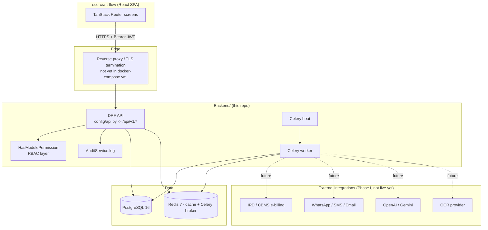

# GreenFlow ERP — Django Backend

Backend for the Ecowrap Nepal ERP (proposal ref. `ETN/PROP/2026/ERP-ECW-001`). This is a
Django 6.1 + Django REST Framework project that will progressively replace the mock data
currently used by the `eco-craft-flow` React frontend, module by module.

> **Status: Phases A–I Record APIs live.** Auth/RBAC/audit/organization (Phase A) plus domain
> `DomainRecord` endpoints for CRM through analytics (Phases B–I) are mounted under `/api/v1/`.
> Statutory engines (live IRD CBMS, OCR vendor, WhatsApp Business, AI gateway) still need
> client credentials. See [§9 Phase status](#9-phase-status) and `docs/`.

---

## 1. Architecture overview

```
Backend/
  config/                  # Project-wide settings, URL routing, Celery app
    settings/
      base.py               # Shared settings (env-driven)
      development.py        # DEBUG=True, SQLite/LocMem dev escape hatches
      production.py         # Hardened settings, fails fast on insecure config
    api.py                  # Aggregates every app's urls.py under /api/v1/
    urls.py                 # Root URLconf (admin, /api/v1/, schema, health)
    celery.py                # Celery("greenflow_erp") app factory
  apps/
    core/                    # Abstract base models, exceptions, pagination envelope,
                             # request-context middleware, health checks, document numbering
    organization/            # Company / Branch / Department / Cost & Profit Centre /
                             # Project / Fiscal Year & Period / Exchange Rate
    accounts/                # Custom User model, JWT auth, full RBAC schema, throttling
    audit/                   # Immutable AuditLog + AuditService (single write path)
    system/                  # SystemSetting / FeatureFlag / NumberingSeriesConfig
    <18 domain apps>/         # DomainRecord models + ViewSets (Phases B–I)
  requirements/
    base.txt / development.txt / production.txt
  Dockerfile, docker-compose.yml
  manage.py
```

**Design principles carried through every app:**

- **UUID primary keys** on every externally-exposed entity (`apps.core.models.BaseModel`).
  Human-readable document numbers (e.g. `SO-2082-83-ITH-000001`) are a separate field, generated
  server-side by `apps.core.services.numbering.generate_document_number()` — never client-side.
- **RBAC is not Django's default Group/Permission system.** Permissions are modelled as
  `Module` → `Screen` (optional) → `Action` → `Role`, enforced on every request by
  `apps.accounts.permissions.HasModulePermission` (fail-closed: a view that doesn't declare
  `module_code` denies everyone except superusers).
- **Every mutation is auditable.** `apps.audit.models.AuditLog` rows can never be updated or
  deleted (enforced at the model layer, not just in the API) — the only way to write one is
  `apps.audit.services.AuditService.log(...)`.
- **Response envelope.** Success responses are wrapped `{ "data": ..., "meta": {...} }`; errors
  are wrapped `{ "error": { "code", "message", "fields" } }`. See
  [API_DOCS.md](API_DOCS.md#2-response-envelope) for the full contract and how it reconciles
  with the frontend's existing documented format.
- **Gregorian is the canonical stored date type.** Bikram Sambat (BS) dates are computed
  on-the-fly for display only (`apps.core.dates.gregorian_to_bs`), never stored as the primary
  date value.

---

## 2. Requirements

- Python 3.12+ (developed/tested against 3.14 locally; Docker image pins `python:3.12-slim`)
- PostgreSQL 16 (production/staging) — **or** SQLite for offline sandbox dev only (see §4)
- Redis 7 (cache + Celery broker/result backend) — falls back to Django's LocMemCache in the
  same sandbox dev mode
- Docker + Docker Compose (optional locally; required for the documented multi-service stack)

---

## 3. Project setup (local, no Docker)

```powershell
cd Backend
python -m venv .venv
.\.venv\Scripts\Activate.ps1
pip install -r requirements/development.txt
copy .env.example .env
```

Edit `.env` and set at minimum:

```
DJANGO_SETTINGS_MODULE=config.settings.development
DJANGO_SECRET_KEY=<any random string for local dev>
DEV_USE_SQLITE=True   # sandbox-only escape hatch, see warning below
```

> **`DEV_USE_SQLITE=True` is a local/offline convenience only.** It swaps `DATABASES` to
> SQLite and, in `development.py`, also swaps `CACHES` to `LocMemCache` and sets
> `CELERY_TASK_ALWAYS_EAGER=True` so the app runs without a real Postgres/Redis server. **Never
> set this in staging or production** — `production.py` does not read this flag at all.

```powershell
python manage.py migrate
python manage.py seed_demo     # optional: seeds company/org data, RBAC catalogue, demo users
python manage.py createsuperuser
python manage.py runserver
```

Run the test suite:

```powershell
python manage.py test
```

Django system checks:

```powershell
python manage.py check           # dev sanity check
python manage.py check --deploy  # production readiness (expect warnings until DEBUG=False + HTTPS)
```

---

## 4. Project setup (Docker)

**Full stack (frontend + backend)** from the repo root — see [`../DOCKER.md`](../DOCKER.md):

```powershell
cd ..
docker compose up --build
```

**Backend only** (this folder):

```powershell
cd Backend
copy .env.example .env   # edit DATABASE_URL etc. to match docker-compose service names
docker compose up --build
```

Services defined in `docker-compose.yml`:

| Service | Image | Purpose |
|---|---|---|
| `db` | `postgres:16-alpine` | Primary database |
| `redis` | `redis:7-alpine` | Cache + Celery broker/result backend |
| `backend` | built from `Dockerfile` | Django (`docker_entrypoint.py` → wait_for_db → migrate → runserver/gunicorn) |
| `celery_worker` | same image | Background task worker |
| `celery_beat` | same image | Scheduled task dispatcher |

Nginx TLS reverse proxy: `docker compose -f docker-compose.prod.yml up -d` (see `deploy/nginx.conf`).

---

## 5. Environment variables

All variables are documented with defaults in [`.env.example`](.env.example). Key groups:

| Group | Variables |
|---|---|
| Django core | `DJANGO_SETTINGS_MODULE`, `DJANGO_SECRET_KEY`, `DJANGO_DEBUG`, `DJANGO_ALLOWED_HOSTS` |
| Database | `DATABASE_URL`, `DEV_USE_SQLITE` |
| Cache/Celery | `REDIS_URL`, `CELERY_BROKER_URL`, `CELERY_RESULT_BACKEND` |
| CORS/CSRF | `CORS_ALLOWED_ORIGINS`, `CSRF_TRUSTED_ORIGINS` |
| JWT | access/refresh token lifetimes |
| Storage | `DJANGO_MEDIA_ROOT`, `STORAGE_BACKEND`, `AWS_*` (only used if `STORAGE_BACKEND=s3`) |
| Integration adapters (config only, no live calls in Phase A) | `OPENAI_API_KEY`, `GOOGLE_GEMINI_API_KEY`, `WHATSAPP_BUSINESS_TOKEN`, `SMS_GATEWAY_API_KEY`, `EMAIL_*`, `IRD_CBMS_*`, `OCR_PROVIDER_API_KEY`, `SENTRY_DSN` |

`production.py` raises `RuntimeError` at import time if `SECRET_KEY`/`ALLOWED_HOSTS` are left at
insecure defaults or if `"*"` appears in CORS origins — this is intentional and cannot be
bypassed by an env flag.

---

## 6. Authentication & RBAC

- JWT via `djangorestframework-simplejwt`. Access token 15 min / refresh 7 days (configurable),
  rotation + blacklist enabled — every refresh invalidates the previous refresh token.
- Login endpoint enforces account lockout: `ERP_ACCOUNT_LOCKOUT_ATTEMPTS` (default 5) failed
  attempts locks the account for `ERP_ACCOUNT_LOCKOUT_MINUTES` (default 15); every attempt
  (success or failure) is recorded in `apps.accounts.models.LoginHistory`.
- Passwords hashed with Argon2 (primary) / PBKDF2 (fallback); a custom complexity validator
  requires upper+lower+digit+symbol on any password set through the change-password endpoint.
- Permission checks are declared per-viewset via a `module_code` (and optional `screen_code`)
  class attribute, enforced by `HasModulePermission`. See
  [API_DOCS.md §4](API_DOCS.md#4-rbac-model) for the full model and how to grant permissions.

Run `python manage.py seed_demo` to create the RBAC catalogue (all 22 module codes, 9 standard
roles) and 5 demo users matching the credentials already documented in
`eco-craft-flow/PROJECT_DOCS.md` (`admin@ecowrap.com` / `admin123`, plus manager/sales/warehouse/
qc `@ecowrap.com` / `demo123`) so the frontend's mock login can point at real JWT auth without
changing any credentials shown in the UI.

---

## 7. Audit trail

Every business mutation should call `apps.audit.services.AuditService.log(...)` with the acting
user, action, module/model identifiers and before/after snapshots. Request context (request ID,
IP, user agent) is captured automatically per-request by
`apps.core.middleware.RequestContextMiddleware` and attached without the caller needing to pass
it explicitly.

`AuditLog` rows cannot be edited or deleted through the ORM, the API, or the Django admin —
`save()` on an existing row and any `delete()` call both raise `PermissionError`. The
`AuditLogViewSet` is read-only (`GET` only) at `/api/v1/audit/logs/`.

---

## 8. API documentation

- Interactive Swagger UI: `http://localhost:8000/api/docs/`
- Redoc: `http://localhost:8000/api/redoc/`
- Raw OpenAPI schema: `http://localhost:8000/api/schema/`
- Written contract + frontend integration mapping: [API_DOCS.md](API_DOCS.md)

Health checks (used by Docker healthcheck and load balancers):

- `GET /health/` — liveness (process is up)
- `GET /health/ready/` — readiness (DB + Redis reachable)

---

## 9. Phase status

| Phase | Scope | Status |
|---|---|---|
| A | Django foundation, Postgres/SQLite, JWT auth, RBAC, audit, organization, system config, Docker/Redis/Celery wiring | **Done** |
| B | CRM, Sales, Procurement Record APIs (customers, leads, quotations, orders, invoices, PO, GRN, …) | **Done** — `DomainRecord` + workflow actions |
| C | Inventory, Warehouse Record APIs (products, batches + genealogy, movements, bins, transfers) | **Done** |
| D | Production / BOM / MRP / machines / work orders | **Done** |
| E | Quality (plans, inspections, NCR, CAPA, CoA) | **Done** |
| F | Accounting / CoA / vouchers / assets / statements | **Done** |
| G | HR, Payroll (employees, leave, recruitment, performance, payroll runs) | **Done** |
| H | Reports, Workflow, Notifications, Documents Record APIs | **Done** |
| I | Compliance (IRD queue), Integrations (WhatsApp/RFID/IoT/backups), Analytics ask gateway | **Done** (third-party credentials still required for live government/Meta/OpenAI calls) |

Do not treat presence of an app in `INSTALLED_APPS` as "feature complete" — check this table and
the app's actual `models.py` before assuming a module has real endpoints.

---

## 10. How this connects to the frontend

The `eco-craft-flow` React app unwraps the `{data, meta}` / `{error}` envelope in
`src/services/api/client.ts` and, on a live JWT session, reads/writes domain records via
`src/services/api/records.ts`. Mock data remains a fallback when the API is down.
See [API_DOCS.md §6](API_DOCS.md#6-frontend-integration-mapping).

Go-live, UAT and training packs: [`docs/go-live-runbook.md`](docs/go-live-runbook.md),
[`docs/uat-scripts.md`](docs/uat-scripts.md), [`docs/training-manual.md`](docs/training-manual.md),
[`docs/milestone-2-checklist.md`](docs/milestone-2-checklist.md).

Production compose (Nginx + TLS + Gunicorn): `docker compose -f docker-compose.prod.yml up -d`.

---

## 11. System design



- **Request path:** every request hits `config/api.py`'s router first; `HasModulePermission`
  (or `HasActionPermission` for custom `@action`s) runs before any view logic; every mutation
  ends with an `AuditService.log(...)` call before the response is serialized into the
  `{"data"/"meta"}` / `{"error"}` envelope.
- **Async path:** anything slow or externally-dependent (report generation, IRD transmission,
  WhatsApp/email notifications, OCR) is dispatched to `celery_worker` via Redis, not run inline
  in the request/response cycle — already wired end-to-end (`CELERY_TASK_ALWAYS_EAGER` applies
  only in the SQLite sandbox dev mode) even though no Phase I task exists yet.
- **Production reverse proxy** — `docker-compose.prod.yml` runs Nginx (80/443) in front of Gunicorn. Place TLS certs in `deploy/certs/`.

## 12. Data model diagrams

Full ER diagrams (the implemented Organization/RBAC schema, and the planned business data model
for Phase B–I) live in `API_DOCS.md` so there is one source of truth instead of two:

- [API_DOCS.md §4 — RBAC model](API_DOCS.md#4-rbac-model) *(implemented)*
- [API_DOCS.md §8 — Organization data model](API_DOCS.md#8-organization-data-model-implemented) *(implemented)*
- [API_DOCS.md §9 — Planned data model, Phase B–I](API_DOCS.md#9-planned-data-model-phase-bi--target-erd) *(target design shared with the frontend)*

## 13. Future plans and implementation guidelines (Phase B–I)

This section is the checklist every future domain app (`apps.crm`, `apps.sales`, ...) must
satisfy before its status in [§9](#9-phase-status) moves from "Not started" to "Done" — the same
bar Phase A was held to.

### 13.1 Definition of done, per app

1. Models inherit `apps.core.models.BaseModel` (UUID PK, `created_at`/`updated_at`, soft-delete
   `is_active`) — never a bare `django.db.models.Model`.
2. Human-readable document numbers (SO/PO/INV/GRN/…) are generated server-side by
   `apps.core.services.numbering.generate_document_number()`, never accepted from the client.
3. Every `ViewSet` declares `module_code` (and `screen_code` where the frontend's forms
   distinguish sub-resources); a data migration seeds the new `Module`/`Screen`/`Action` rows
   (extend `seed_demo`, don't hand-edit the RBAC tables in the admin).
4. Every mutating action calls `apps.audit.services.AuditService.log(...)` — never
   `AuditLog.objects.create(...)` directly.
5. New business-rule failures raise a typed exception mapped to a stable `error.code`, added to
   the table in `API_DOCS.md §5` in the same change (never invent an ad-hoc error shape).
6. Fiscal-period-aware postings (invoices, vouchers, payroll runs, stock valuation journals) call
   `apps.organization.services.assert_period_open(...)` before writing.
7. Serializer field names match `eco-craft-flow/src/features/forms/definitions.ts` for that
   entity field-for-field — check `eco-craft-flow/API_DOCS.md §3` before naming a field.
8. Tests: model tests, permission tests (allowed role passes, wrong role gets 403, anonymous gets
   401), and at least one end-to-end test per resource mirroring the
   `ModulePermissionEndpointTests` pattern already used in `apps/accounts/tests/`.
9. OpenAPI: tag the viewset for `drf-spectacular`; regenerate `/api/schema/` and check
   `/api/docs/` renders correctly before marking the phase done.
10. Update `Backend/README.md §9` and `Backend/API_DOCS.md §6` (frontend integration mapping) in
    the same change that lands the models — documentation drift is treated as a bug, not a
    follow-up task.

### 13.2 Phase-by-phase build order

| Phase | Apps | Core models to add | Key cross-app dependency |
|---|---|---|---|
| B | `crm`, `sales`, `procurement` | Customer, Lead, Quotation, Dealer · SalesOrder, SalesInvoice, Payment, SalesReturn · Supplier, PurchaseOrder, GoodsReceipt, PurchaseReturn | `organization.Company` / `FiscalPeriod` (already live) |
| C | `inventory`, `warehouse` | Product, StockMovement, WarehouseLocation | `procurement.GoodsReceipt` (stock in), `sales.SalesOrder` (stock out) |
| D | `production`, `planning` | BOM, ProductionOrder, MachineSchedule | `inventory.Product` (components + output); MRP reads `procurement`/`sales` demand |
| E | `quality` | QCInspection, NCR, CAPA | `procurement.GoodsReceipt` (incoming), `production.ProductionOrder` (in-process/final) |
| F | `accounting` | Voucher, Expense, chart of accounts, Outstanding | Every posting module (sales, procurement, payroll) writes vouchers here |
| G | `hr`, `payroll` | Employee, Leave, PayrollRun (Department already in `organization`) | `organization.Department`; feeds `accounting.Voucher` |
| H | `reports`, `workflow`, `notifications`, `documents` | Report definitions/exports, ApprovalChain, Notification, Document | Reads across every module above; workflow gates `approve`/`reject` actions everywhere |
| I | `compliance`, `integrations`, `analytics` | IRD/CBMS submission log, WhatsApp/SMS/Email delivery log, AI insight cache | `accounting` (e-billing), `sales`/`crm` (WhatsApp), all modules (analytics) |

Each phase ships in this order because later phases assume earlier phases' models exist (e.g.
Production's MRP needs `procurement`'s supplier lead times and `sales`'s demand). Do not start a
phase's models until the phase above it is genuinely done per §13.1, not just scaffolded.
