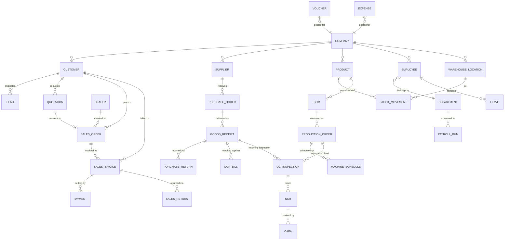

# EcoWrap Nepal ERP — REST API Specification

Version 1.0 · Reference ETN/PROP/2026/ERP-ECW-001

This document is the contract the React front end expects from the Django REST Framework backend. The UI currently runs on in-memory mock data; no backend calls are wired. Every screen already reads/writes through typed service functions and schema-driven forms, so switching to live data is a base-URL change plus these endpoints.

## 1. Conventions

- Base URL: `/api/v1/`
- Auth: `Authorization: Bearer <JWT>` (SimpleJWT). `POST /api/v1/auth/login/`, `/auth/refresh/`, `/auth/logout/`, `/auth/password-reset/`, `/auth/password-reset/confirm/`.
- Content type: `application/json`; file upload endpoints use `multipart/form-data`.
- Identifiers: UUID strings in `id`.
- Money: integer or decimal string in NPR; dates ISO-8601 (`YYYY-MM-DD`), BS date shown in UI only.
- Pagination: `?page=&page_size=` → `{ count, next, previous, results: [] }`.
- Filtering: `?search=`, `?ordering=`, plus documented per-resource filters.
- Errors: DRF shape `{ "detail": "..." }` or `{ "field": ["message"] }` with 400/401/403/404/409/422.
- Every mutating endpoint must write an audit-log entry (see §5).

> **Envelope note (reconciled with the backend):** the bullet above describes this document's
> original raw-DRF assumption. The Django backend actually wraps every response in
> `{"data"/"meta"}` / `{"error":{"code","message","fields"}}` — see [§10](#10-roadmap--implementation-order-and-guidelines)
> and `Backend/API_DOCS.md §2` for the authoritative shape and how `client.ts` should unwrap it.

## 2. Standard resource verbs

Unless stated otherwise, every resource below supports:

| Verb | Path | Purpose |
|---|---|---|
| GET | `/{resource}/` | Paginated list with search/filter |
| POST | `/{resource}/` | Create (payload = form schema in §3) |
| GET | `/{resource}/{id}/` | Retrieve |
| PATCH | `/{resource}/{id}/` | Partial update |
| DELETE | `/{resource}/{id}/` | Soft delete (sets `is_active=false`) |

## 3. Resources and request payloads

Field tables are generated from the live form schemas in `src/features/forms/definitions.ts`, so the UI and this document cannot drift.

### 3.x Customer — `customer`

Master record used across CRM, sales, dispatch and receivables.

**Create endpoint:** `POST /api/v1/crm/customers/`  
**Allowed roles:** manager, sales

| Field | Label | Type | Required | Allowed values |
|---|---|---|---|---|
| `code` | Customer code | string | yes | — |
| `name` | Business name | string | yes | — |
| `type` | Customer type | enum | yes | `distributor`, `retailer`, `corporate`, `government` |
| `pan` | PAN / VAT no. | string | no | — |
| `contact` | Contact person | string | yes | — |
| `phone` | Phone | string | yes | — |
| `email` | Email | string (email) | no | — |
| `city` | City | string | no | — |
| `address` | Billing address | string | no | — |
| `creditLimit` | Credit limit | decimal | no | min 0, max - |
| `creditDays` | Credit days | integer | no | min 0, max 180 |
| `priceList` | Price list | enum | no | `standard`, `distributor`, `export` |
| `active` | Active | boolean | no | — |

### 3.x Lead — `lead`

Capture an enquiry and place it on the pipeline.

**Create endpoint:** `POST /api/v1/crm/leads/`  
**Allowed roles:** all authenticated

| Field | Label | Type | Required | Allowed values |
|---|---|---|---|---|
| `company` | Company | string | yes | — |
| `contact` | Contact person | string | yes | — |
| `phone` | Phone | string | yes | — |
| `email` | Email | string (email) | no | — |
| `source` | Source | enum | yes | `referral`, `website`, `cold_call`, `trade_show`, `social` |
| `stage` | Stage | enum | no | `new`, `contacted`, `qualified`, `proposal`, `won`, `lost` |
| `value` | Estimated value | decimal | no | min 0, max - |
| `owner` | Assigned to | string | no | — |
| `notes` | Notes | string | no | — |

### 3.x Quotation — `quotation`

Priced offer that can be converted to a sales order in one click.

**Create endpoint:** `POST /api/v1/crm/quotations/`  
**Allowed roles:** all authenticated

| Field | Label | Type | Required | Allowed values |
|---|---|---|---|---|
| `number` | Quotation no. | string | yes | — |
| `customer` | Customer | string | yes | — |
| `date` | Quotation date | date | yes | — |
| `validTill` | Valid till | date | no | — |
| `items` | Line items | integer | no | min 1, max - |
| `amount` | Net amount | decimal | yes | min 0, max - |
| `tax` | Tax | enum | no | `vat_13`, `vat_exempt` |
| `status` | Status | enum | no | `draft`, `sent`, `accepted`, `rejected`, `expired` |
| `terms` | Terms & conditions | string | no | — |

### 3.x Sales Order — `salesOrder`

Confirmed customer order; credit and stock checks run on release.

**Create endpoint:** `POST /api/v1/sales/orders/`  
**Allowed roles:** all authenticated

| Field | Label | Type | Required | Allowed values |
|---|---|---|---|---|
| `number` | Order no. | string | yes | — |
| `customer` | Customer | string | yes | — |
| `date` | Order date | date | yes | — |
| `deliveryDate` | Delivery due | date | yes | — |
| `warehouse` | Dispatch warehouse | enum | no | `main`, `production_store` |
| `priority` | Priority | enum | no | `normal`, `urgent` |
| `items` | Line items | integer | no | min 1, max - |
| `amount` | Order value | decimal | yes | min 0, max - |
| `advance` | Advance received | decimal | no | min 0, max - |
| `remarks` | Remarks | string | no | — |

### 3.x Sales Invoice — `invoice`

VAT invoice; transmitted to IRD/CBMS by the backend on posting.

**Create endpoint:** `POST /api/v1/sales/invoices/`  
**Allowed roles:** all authenticated

| Field | Label | Type | Required | Allowed values |
|---|---|---|---|---|
| `number` | Invoice no. | string | yes | — |
| `customer` | Customer | string | yes | — |
| `orderRef` | Against sales order | string | no | — |
| `date` | Invoice date | date | yes | — |
| `dueDate` | Payment due | date | no | — |
| `amount` | Invoice amount | decimal | yes | min 0, max - |
| `vat` | VAT treatment | enum | no | `vat_13`, `vat_exempt`, `export` |
| `status` | Status | enum | no | `unpaid`, `partial`, `paid` |

### 3.x Record Payment — `payment`

Receipt against a customer invoice.

**Create endpoint:** `POST /api/v1/sales/payments/`  
**Allowed roles:** all authenticated

| Field | Label | Type | Required | Allowed values |
|---|---|---|---|---|
| `customer` | Customer | string | yes | — |
| `invoice` | Invoice no. | string | yes | — |
| `date` | Received on | date | yes | — |
| `amount` | Amount | decimal | yes | min 1, max - |
| `mode` | Mode | enum | yes | `cash`, `bank`, `cheque`, `esewa`, `khalti` |
| `reference` | Reference no. | string | no | — |
| `note` | Note | string | no | — |

### 3.x Sales Return — `salesReturn`

Customer return authorisation with reason code and credit note.

**Create endpoint:** `POST /api/v1/sales/returns/`  
**Allowed roles:** all authenticated

| Field | Label | Type | Required | Allowed values |
|---|---|---|---|---|
| `number` | Return no. | string | yes | — |
| `customer` | Customer | string | yes | — |
| `invoice` | Original invoice | string | yes | — |
| `date` | Return date | date | yes | — |
| `batch` | Batch no. | string | no | — |
| `qty` | Quantity | integer | yes | min 1, max - |
| `reason` | Reason code | enum | yes | `damaged`, `wrong_item`, `quality_issue`, `excess_supply`, `expired` |
| `disposition` | Disposition | enum | no | `restock`, `quarantine`, `scrap` |
| `creditAmount` | Credit note amount | decimal | no | min 0, max - |
| `remarks` | Remarks | string | no | — |

### 3.x Dealer / Agent — `dealer`

Channel partner with territory, commission and consignment stock.

**Create endpoint:** `POST /api/v1/crm/dealers/`  
**Allowed roles:** all authenticated

| Field | Label | Type | Required | Allowed values |
|---|---|---|---|---|
| `code` | Partner code | string | yes | — |
| `name` | Name | string | yes | — |
| `kind` | Type | enum | yes | `dealer`, `agent`, `distributor` |
| `territory` | Territory | string | no | — |
| `phone` | Phone | string | yes | — |
| `email` | Email | string (email) | no | — |
| `commission` | Commission % | integer | no | min 0, max 100 |
| `target` | Monthly target | decimal | no | min 0, max - |

### 3.x Supplier — `supplier`

Vendor master used by procurement, GRN and payables.

**Create endpoint:** `POST /api/v1/purchase/suppliers/`  
**Allowed roles:** all authenticated

| Field | Label | Type | Required | Allowed values |
|---|---|---|---|---|
| `code` | Supplier code | string | yes | — |
| `name` | Supplier name | string | yes | — |
| `type` | Supply type | enum | yes | `raw_material`, `packaging`, `machinery`, `service` |
| `pan` | PAN / VAT no. | string | no | — |
| `contact` | Contact person | string | no | — |
| `phone` | Phone | string | yes | — |
| `email` | Email | string (email) | no | — |
| `city` | City | string | no | — |
| `paymentTerms` | Payment terms | enum | no | `advance`, `net_15`, `net_30`, `net_45` |
| `rating` | Quality rating (1-5) | integer | no | min 1, max 5 |

### 3.x Purchase Order — `purchaseOrder`

Raised manually or from an MRP-generated requisition.

**Create endpoint:** `POST /api/v1/purchase/orders/`  
**Allowed roles:** all authenticated

| Field | Label | Type | Required | Allowed values |
|---|---|---|---|---|
| `number` | PO no. | string | yes | — |
| `supplier` | Supplier | string | yes | — |
| `date` | PO date | date | yes | — |
| `expected` | Expected delivery | date | yes | — |
| `items` | Line items | integer | no | min 1, max - |
| `amount` | PO value | decimal | yes | min 0, max - |
| `terms` | Terms | string | no | — |

### 3.x Goods Receipt — `goodsReceipt`

GRN with batch capture and incoming inspection hook.

**Create endpoint:** `POST /api/v1/purchase/receipts/`  
**Allowed roles:** all authenticated

| Field | Label | Type | Required | Allowed values |
|---|---|---|---|---|
| `number` | GRN no. | string | yes | — |
| `po` | Against PO | string | yes | — |
| `supplier` | Supplier | string | yes | — |
| `date` | Received on | date | yes | — |
| `item` | Item | string | yes | — |
| `batch` | Batch no. | string | yes | — |
| `qty` | Quantity received | integer | yes | min 1, max - |
| `uom` | UOM | enum | no | `kg`, `pcs`, `roll`, `ctn` |
| `warehouse` | Put-away location | string | no | — |
| `qcStatus` | QC status | enum | no | `pending`, `accepted`, `rejected` |

### 3.x Purchase Return — `purchaseReturn`

Return-to-vendor with debit note and vendor scorecard update.

**Create endpoint:** `POST /api/v1/purchase/returns/`  
**Allowed roles:** all authenticated

| Field | Label | Type | Required | Allowed values |
|---|---|---|---|---|
| `number` | Return no. | string | yes | — |
| `supplier` | Supplier | string | yes | — |
| `grn` | Against GRN | string | yes | — |
| `date` | Return date | date | yes | — |
| `item` | Item | string | yes | — |
| `batch` | Batch no. | string | no | — |
| `qty` | Quantity | integer | yes | min 1, max - |
| `reason` | Reason | enum | yes | `quality_reject`, `short_supply`, `wrong_item`, `damaged_in_transit` |
| `debitAmount` | Debit note amount | decimal | no | min 0, max - |
| `remarks` | Remarks | string | no | — |

### 3.x Product — `product`

Item master with UOM, valuation and reorder policy.

**Create endpoint:** `POST /api/v1/inventory/products/`  
**Allowed roles:** all authenticated

| Field | Label | Type | Required | Allowed values |
|---|---|---|---|---|
| `sku` | SKU | string | yes | — |
| `name` | Product name | string | yes | — |
| `type` | Item type | enum | yes | `raw_material`, `semi_finished`, `finished_goods`, `packaging` |
| `category` | Category | string | no | — |
| `barcode` | Barcode | string | no | — |
| `uom` | Base UOM | enum | yes | `kg`, `pcs`, `roll`, `ctn`, `m` |
| `openingStock` | Opening stock | integer | no | min 0, max - |
| `reorderLevel` | Reorder level | integer | no | min 0, max - |
| `safetyStock` | Safety stock | integer | no | min 0, max - |
| `moq` | Minimum order qty | integer | no | min 0, max - |
| `rate` | Standard rate | decimal | no | min 0, max - |
| `valuation` | Valuation method | enum | no | `fifo`, `weighted_average`, `standard_cost` |
| `batchTracked` | Batch tracked | boolean | no | — |
| `active` | Active | boolean | no | — |

### 3.x Stock Movement — `stockMovement`

Stock in, out, transfer or adjustment with document reference.

**Create endpoint:** `POST /api/v1/inventory/movements/`  
**Allowed roles:** all authenticated

| Field | Label | Type | Required | Allowed values |
|---|---|---|---|---|
| `kind` | Movement type | enum | yes | `in`, `out`, `transfer`, `adjustment` |
| `date` | Date | date | yes | — |
| `item` | Item | string | yes | — |
| `batch` | Batch no. | string | no | — |
| `qty` | Quantity | integer | yes | — |
| `uom` | UOM | enum | no | `kg`, `pcs`, `roll`, `ctn` |
| `fromLocation` | From location | string | no | — |
| `toLocation` | To location | string | no | — |
| `reference` | Document ref. | string | no | — |
| `reason` | Reason | string | no | — |

### 3.x Location / Bin — `warehouseLocation`

Warehouse structure down to rack and bin.

**Create endpoint:** `POST /api/v1/warehouse/locations/`  
**Allowed roles:** all authenticated

| Field | Label | Type | Required | Allowed values |
|---|---|---|---|---|
| `code` | Bin code | string | yes | — |
| `warehouse` | Warehouse | enum | yes | `main`, `production_store`, `quarantine` |
| `zone` | Zone | string | no | — |
| `capacity` | Capacity | integer | no | min 0, max - |
| `uom` | Capacity UOM | enum | no | `kg`, `pcs`, `ctn` |
| `keeper` | Store keeper | string | no | — |
| `blocked` | Blocked for dispatch | boolean | no | — |

### 3.x Bill of Materials — `bom`

Versioned BOM with scrap and yield per component.

**Create endpoint:** `POST /api/v1/production/boms/`  
**Allowed roles:** all authenticated

| Field | Label | Type | Required | Allowed values |
|---|---|---|---|---|
| `code` | BOM code | string | yes | — |
| `product` | Finished product | string | yes | — |
| `version` | Version | string | yes | — |
| `effectiveFrom` | Effective from | date | yes | — |
| `outputQty` | Output quantity | integer | yes | min 1, max - |
| `uom` | Output UOM | enum | no | `kg`, `pcs`, `roll` |
| `status` | Status | enum | no | `draft`, `active`, `obsolete` |
| `notes` | Notes | string | no | — |

### 3.x Production Order — `productionOrder`

Work order against a BOM, line and shift.

**Create endpoint:** `POST /api/v1/production/orders/`  
**Allowed roles:** all authenticated

| Field | Label | Type | Required | Allowed values |
|---|---|---|---|---|
| `number` | Order no. | string | yes | — |
| `product` | Product | string | yes | — |
| `bom` | BOM | string | yes | — |
| `plannedQty` | Planned quantity | integer | yes | min 1, max - |
| `startDate` | Start date | date | yes | — |
| `dueDate` | Due date | date | yes | — |
| `line` | Production line | enum | no | `line_a`, `line_b`, `line_c` |
| `shift` | Shift | enum | no | `morning`, `evening`, `night` |
| `supervisor` | Supervisor | string | no | — |
| `priority` | Priority | enum | no | `normal`, `urgent` |

### 3.x Schedule Machine Slot — `machineSchedule`

Work-centre capacity booking with setup and run time.

**Create endpoint:** `POST /api/v1/production/schedules/`  
**Allowed roles:** all authenticated

| Field | Label | Type | Required | Allowed values |
|---|---|---|---|---|
| `machine` | Machine / work centre | string | yes | — |
| `order` | Work order | string | yes | — |
| `date` | Date | date | yes | — |
| `shift` | Shift | enum | yes | `morning`, `evening`, `night` |
| `setupMins` | Setup time (min) | integer | no | min 0, max - |
| `runMins` | Run time (min) | integer | no | min 0, max - |
| `operator` | Operator | string | no | — |
| `status` | Status | enum | no | `planned`, `running`, `completed`, `maintenance` |

### 3.x Inspection — `qcInspection`

Incoming, in-process or final inspection against a quality plan.

**Create endpoint:** `POST /api/v1/quality/inspections/`  
**Allowed roles:** all authenticated

| Field | Label | Type | Required | Allowed values |
|---|---|---|---|---|
| `number` | Inspection no. | string | yes | — |
| `stage` | Stage | enum | yes | `incoming`, `in_process`, `final` |
| `reference` | Reference document | string | no | — |
| `item` | Item | string | yes | — |
| `batch` | Batch no. | string | yes | — |
| `date` | Inspected on | date | yes | — |
| `sampleSize` | Sample size | integer | no | min 1, max - |
| `defects` | Defects found | integer | no | min 0, max - |
| `result` | Result | enum | yes | `pass`, `fail`, `conditional` |
| `inspector` | Inspector | string | no | — |
| `observation` | Observation | string | no | — |

### 3.x Non-Conformance Report — `ncr`

Raised from inspection, production, complaint or audit.

**Create endpoint:** `POST /api/v1/quality/ncrs/`  
**Allowed roles:** all authenticated

| Field | Label | Type | Required | Allowed values |
|---|---|---|---|---|
| `number` | NCR no. | string | yes | — |
| `source` | Source | enum | yes | `inspection`, `production`, `customer_complaint`, `audit` |
| `date` | Raised on | date | yes | — |
| `item` | Item / process | string | yes | — |
| `batch` | Batch no. | string | no | — |
| `severity` | Severity | enum | yes | `minor`, `major`, `critical` |
| `disposition` | Disposition | enum | no | `use_as_is`, `rework`, `regrade`, `reject`, `return_to_vendor` |
| `cost` | Cost of non-conformance | decimal | no | min 0, max - |
| `description` | Description | string | yes | — |

### 3.x CAPA — `capa`

Corrective and preventive action with owner and verification.

**Create endpoint:** `POST /api/v1/quality/capas/`  
**Allowed roles:** all authenticated

| Field | Label | Type | Required | Allowed values |
|---|---|---|---|---|
| `number` | CAPA no. | string | yes | — |
| `ncr` | Linked NCR | string | no | — |
| `owner` | Owner | string | yes | — |
| `openedOn` | Opened on | date | yes | — |
| `dueOn` | Target closure | date | yes | — |
| `stage` | Stage | enum | yes | `containment`, `root_cause`, `corrective`, `preventive`, `verification`, `closed` |
| `problem` | Problem statement | string | yes | — |
| `rootCause` | Root cause | string | no | — |
| `action` | Action taken | string | no | — |

### 3.x Employee — `employee`

Employee master with department, grade and salary.

**Create endpoint:** `POST /api/v1/hr/employees/`  
**Allowed roles:** all authenticated

| Field | Label | Type | Required | Allowed values |
|---|---|---|---|---|
| `code` | Employee code | string | yes | — |
| `name` | Full name | string | yes | — |
| `phone` | Phone | string | yes | — |
| `email` | Email | string (email) | no | — |
| `address` | Address | string | no | — |
| `department` | Department | enum | yes | `production`, `quality`, `warehouse`, `sales`, `accounts`, `hr`, `maintenance` |
| `designation` | Designation | string | yes | — |
| `joinDate` | Joining date | date | yes | — |
| `employmentType` | Employment type | enum | no | `permanent`, `contract`, `probation`, `daily_wage` |
| `shift` | Default shift | enum | no | `morning`, `evening`, `night`, `general` |
| `salary` | Monthly salary | decimal | yes | min 0, max - |
| `ssfNumber` | SSF number | string | no | — |
| `bankAccount` | Bank account | string | no | — |

### 3.x Leave Request — `leave`

Application routed through the approval workflow.

**Create endpoint:** `POST /api/v1/hr/leaves/`  
**Allowed roles:** all authenticated

| Field | Label | Type | Required | Allowed values |
|---|---|---|---|---|
| `employee` | Employee | string | yes | — |
| `type` | Leave type | enum | yes | `annual`, `sick`, `casual`, `unpaid`, `maternity` |
| `from` | From | date | yes | — |
| `to` | To | date | yes | — |
| `days` | Days | integer | no | min 0.5, max - |
| `reason` | Reason | string | yes | — |

### 3.x Payroll Run — `payrollRun`

Period payroll with attendance, overtime and statutory deductions.

**Create endpoint:** `POST /api/v1/hr/payroll-runs/`  
**Allowed roles:** all authenticated

| Field | Label | Type | Required | Allowed values |
|---|---|---|---|---|
| `period` | Payroll period | string | yes | — |
| `payDate` | Pay date | date | yes | — |
| `department` | Department | enum | no | `all`, `production`, `quality`, `warehouse`, `sales`, `accounts`, `hr` |
| `includeOvertime` | Include overtime | boolean | no | — |
| `includeIncentive` | Include production incentive | boolean | no | — |
| `remarks` | Remarks | string | no | — |

### 3.x Voucher — `voucher`

Double-entry voucher posted to the general ledger.

**Create endpoint:** `POST /api/v1/accounting/vouchers/`  
**Allowed roles:** all authenticated

| Field | Label | Type | Required | Allowed values |
|---|---|---|---|---|
| `number` | Voucher no. | string | yes | — |
| `type` | Voucher type | enum | yes | `receipt`, `payment`, `journal`, `contra` |
| `date` | Voucher date | date | yes | — |
| `party` | Party / account | string | yes | — |
| `debitAccount` | Debit account | string | yes | — |
| `creditAccount` | Credit account | string | yes | — |
| `amount` | Amount | decimal | yes | min 1, max - |
| `costCentre` | Cost centre | string | no | — |
| `narration` | Narration | string | no | — |

### 3.x Expense — `expense`

Operating expense booked against a category and cost centre.

**Create endpoint:** `POST /api/v1/accounting/expenses/`  
**Allowed roles:** all authenticated

| Field | Label | Type | Required | Allowed values |
|---|---|---|---|---|
| `date` | Date | date | yes | — |
| `category` | Category | enum | yes | `utilities`, `transport`, `maintenance`, `salary`, `marketing`, `office`, `other` |
| `payee` | Paid to | string | yes | — |
| `amount` | Amount | decimal | yes | min 1, max - |
| `mode` | Payment mode | enum | no | `cash`, `bank`, `cheque`, `esewa` |
| `reference` | Bill / reference no. | string | no | — |
| `status` | Status | enum | no | `paid`, `pending` |
| `note` | Note | string | no | — |

### 3.x Scan Vendor Bill — `ocrBill`

Upload a vendor bill; OCR extracts header and line values for review.

**Create endpoint:** `POST /api/v1/purchase/ocr-bills/`  
**Allowed roles:** all authenticated

| Field | Label | Type | Required | Allowed values |
|---|---|---|---|---|
| `supplier` | Supplier | string | yes | — |
| `billNumber` | Bill no. | string | no | — |
| `billDate` | Bill date | date | no | — |
| `amount` | Bill amount | decimal | no | min 0, max - |
| `po` | Match against PO | string | no | — |
| `source` | Capture source | enum | yes | `scanner`, `mobile_camera`, `email_inbox`, `upload` |
| `note` | Note for reviewer | string | no | — |

### 3.x User — `systemUser`

System login with role-based permissions.

**Create endpoint:** `POST /api/v1/admin/users/`  
**Allowed roles:** manager

| Field | Label | Type | Required | Allowed values |
|---|---|---|---|---|
| `name` | Full name | string | yes | — |
| `email` | Email | string (email) | yes | — |
| `role` | Role | enum | yes | `administrator`, `manager`, `sales`, `purchase`, `warehouse`, `production`, `hr`, `quality_control`, `viewer` |
| `phone` | Phone | string | no | — |
| `active` | Active | boolean | no | — |

## 4. Workflow endpoints (beyond CRUD)

| Action | Endpoint | Notes |
|---|---|---|
| Convert quotation to sales order | `POST /api/v1/crm/quotations/{id}/convert/` | Returns the created sales order |
| Approve quotation / PO / voucher | `POST /api/v1/{module}/{resource}/{id}/approve/` | Role-gated, audited |
| Sales order → invoice | `POST /api/v1/sales/orders/{id}/invoice/` | Partial invoicing supported via `lines[]` |
| Dispatch note | `POST /api/v1/warehouse/dispatch/` | Blocked (409) if any batch is quarantined |
| Goods receipt → QC | `POST /api/v1/quality/incoming/` | Auto-created on GRN with `qc_required=true` |
| Release / reject quarantine | `POST /api/v1/quality/quarantine/{id}/release/` \| `/reject/` | Requires QC role |
| Run MRP | `POST /api/v1/production/mrp/run/` | Body `{ horizon_days }`, returns suggestions |
| Firm MRP suggestion | `POST /api/v1/production/mrp/{id}/firm/` | Creates PR or work order |
| Post material consumption | `POST /api/v1/production/consumption/` | Decrements RM stock, links RM batch → FG batch |
| Batch genealogy | `GET /api/v1/production/batches/{id}/genealogy/` | ISO 17088 traceability tree |
| OCR bill upload | `POST /api/v1/purchase/ocr-bills/` (multipart) | Returns parsed fields + confidence |
| Post OCR bill | `POST /api/v1/purchase/ocr-bills/{id}/post/` | Creates supplier bill after review |
| Payroll run | `POST /api/v1/hr/payroll-runs/` then `/{id}/approve/`, `/{id}/pay/` | SSF/TDS computed server-side |
| Report export | `GET /api/v1/reports/{report}/?format=csv\|pdf` | Streams file |
| Notifications | `GET /api/v1/notifications/`, `POST /{id}/read/`, `POST /read-all/` | |

## 5. Audit log

`GET /api/v1/system/audit-logs/?user=&action=&module=&date_from=&date_to=`

Entry shape: `{ id, time, user, role, action, module, record, ip }` where `action ∈ create|update|delete|approve|login|export`. Entries are append-only; no update or delete endpoints.

## 6. Master data & settings

| Resource | Endpoint |
|---|---|
| Company profile | `/api/v1/settings/company/` (singleton, GET/PATCH) |
| Users | `/api/v1/system/users/` |
| Roles & permissions | `/api/v1/system/roles/` |
| Tax rates | `/api/v1/masters/taxes/` |
| Units of measure | `/api/v1/masters/units/` |
| Product categories | `/api/v1/masters/categories/` |
| Warehouses | `/api/v1/masters/warehouses/` |
| Notification preferences | `/api/v1/settings/notifications/` |

## 7. Suggested Django app layout

```text
config/            settings, urls, celery
apps/accounts/     users, roles, JWT, audit middleware
apps/crm/          customers, leads, quotations, dealers
apps/sales/        orders, invoices, payments, returns
apps/purchase/     suppliers, POs, GRN, returns, ocr
apps/inventory/    products, movements, valuation
apps/warehouse/    locations, receiving, dispatch, counts
apps/production/   bom, orders, mrp, scheduling, batches
apps/quality/      inspections, quarantine, ncr, capa
apps/hr/           employees, attendance, leave, payroll
apps/accounting/   vouchers, expenses, accounts, outstanding
apps/reports/      read-only aggregates + exports
apps/system/       notifications, audit log, masters
```

## 8. Front-end integration steps

1. Set `API_BASE_URL` in `src/services/api/client.ts` to the Django origin.
2. Replace each `src/features/<module>/mock.ts` import with the matching service call; component props are unchanged.
3. Wrap reads in TanStack Query (`queryKey: [module, filters]`).
4. Point `RecordFormDialog.onSubmit` at `apiFetch(definition.endpoint)`.
5. Swap the mock login in `src/store/auth.ts` for `/auth/login/` and store the JWT pair.

## 9. Data model & relationships



This is the relationship model behind §3's field tables — see `Backend/API_DOCS.md §9` for the
backend's copy of the same diagram and the phase order it must be built in.

## 10. Roadmap / implementation order and guidelines

This document specifies the contract; `README.md § Roadmap` and `PROJECT_DOCS.md §13` specify
the order and rules for actually wiring it up. Two contract-level rules worth restating here:

- **Response envelope.** Every endpoint above returns the Django backend's
  `{"data":...,"meta":{...}}` / `{"error":{"code","message","fields"}}` envelope (see
  `Backend/API_DOCS.md §2`), not the raw `{"detail":...}` shape this document's §1 originally
  assumed — `client.ts` unwraps `data`/`error` once, so every function in
  `services/api/*.ts` can keep returning the plain resource type shown in §3's field tables.
- **Everything in §3 is a target, not a guarantee.** Cross-check
  `Backend/API_DOCS.md §6 Frontend integration mapping` before wiring any single resource — it
  states, endpoint by endpoint, whether that Django route actually exists yet.
