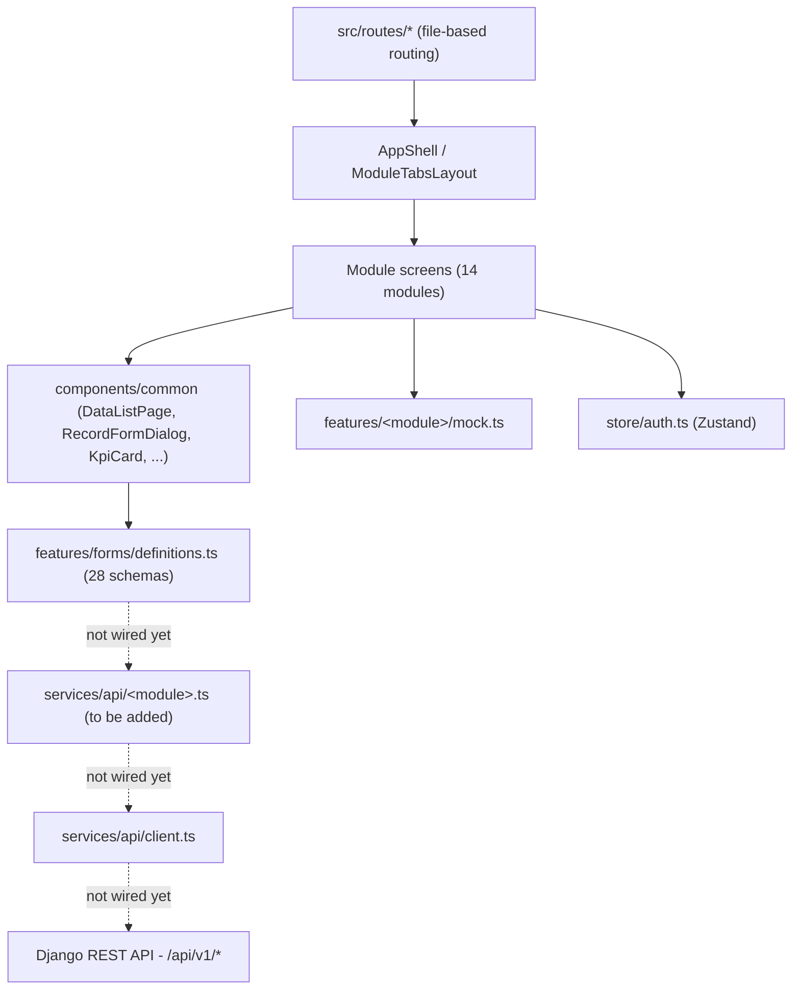
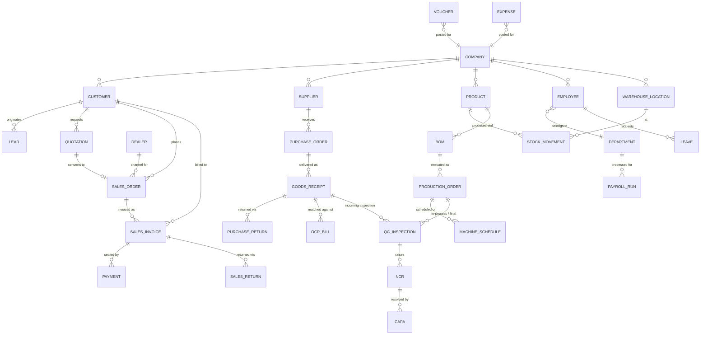

# EcoWrap Nepal ERP — Project Documentation

**Client:** EcoWrap Nepal Pvt. Ltd. (compostable packaging manufacturer, ISO 17088)
**Proposal reference:** ETN/PROP/2026/ERP-ECW-001
**Deliverable in this repository:** the complete, mobile-first front end of the ERP, running on typed mock data and ready to be connected to a Django REST backend. **No backend is integrated in this codebase by design.**

---

## 1. Scope

| In scope (this repo) | Out of scope (Django team) |
|---|---|
| All module screens, tabs and navigation | Database, migrations, ORM models |
| Schema-driven forms with validation for every entity | Authentication server, JWT issuing |
| Role-based access control on the client | Server-side permission enforcement |
| Mock data mirroring real record shapes | Business rule execution, MRP engine, OCR |
| Reports with CSV export and print | PDF rendering, scheduled jobs, e-mail/WhatsApp |
| API contract (`API_DOCS.md`) | Endpoint implementation |

---

## 2. Technology

React 19 · TypeScript · Vite 7 · TanStack Start / Router (file-based routing) · TanStack Query · Zustand (auth + persistence) · React Hook Form + Zod · Tailwind CSS v4 · shadcn/ui · Recharts · lucide-react.

---

## 3. Folder structure

```text
src/
  routes/                       file-based routes; `_app.*` = authenticated shell
  components/
    ui/                         shadcn primitives
    layout/AppShell.tsx         sidebar + topbar + mobile drawer
    layout/ModuleTabsLayout.tsx shared module header + tab bar (used by all 8 modules)
    common/                     KpiCard, PageHeader, StatusBadge, EmptyState,
                                DataListPage, RecordFormDialog, NewRecordButton,
                                ReportToolbar
  features/
    <module>/mock.ts            typed demo data per module
    extended/mock.ts            proposal-added modules (returns, dealers, OCR,
                                MRP, scheduling, NCR, CAPA, payroll, audit)
    forms/types.ts              form schema types
    forms/definitions.ts        28 entity form schemas + Django endpoints
  services/api/client.ts        fetch wrapper; single place to point at Django
  store/auth.ts                 mock JWT, demo users, persisted session
  constants/                    roles, navigation registry
  lib/                          cn(), permissions, CSV export, formatters
  styles.css                    design tokens (OKLCH green theme, light + dark)
```

---

## 4. Modules and routes

| Module | Route | Sub-screens |
|---|---|---|
| Dashboard | `/dashboard` | KPI strip, sales vs production chart, low stock, recent orders |
| CRM | `/crm` | Customers · Leads (Kanban) · Quotations · Dealers & Agents |
| Sales | `/sales` | Orders · Invoices · Payments · Sales Returns |
| Purchase | `/purchase` | Suppliers · Purchase Orders · Goods Receipt · Purchase Returns · Bill Scanning (OCR) · Vendor Payments |
| Inventory | `/inventory` | Products (RM/SFG/FG/Packaging) · Stock Movements · Low Stock |
| Warehouse | `/warehouse` | Locations & bins · Receiving · Dispatch · Stock Count |
| Production | `/production` | BOM · Work Orders · MRP · Machine Schedule · Consumption · FG Batches |
| Quality Control | `/quality-control` | Incoming · In-Process · FG Inspection · Quarantine · NCR · CAPA |
| HR | `/hr` | Employees · Departments · Attendance · Leave · Payroll |
| Accounting | `/accounting` | Vouchers · Expenses · Cash & Bank · Outstanding |
| Reports | `/reports` | Sales · Purchase · Inventory · Production & QC · Financial |
| Notifications | `/notifications` | Feed with priority/category filters |
| Audit Logs | `/audit-logs` | Append-only action trail |
| Settings | `/settings` | Company · Users & Roles · Masters · Alert preferences |
| Auth | `/login`, `/forgot-password`, `/reset-password`, `/profile` | Mock session |

---

## 5. Design system

- Tokens live in `src/styles.css` as OKLCH variables — primary `#16A34A`, secondary `#15803D`, accent `#22C55E`, with a full dark theme. Components never hardcode colours.
- Cards use `rounded-2xl`, subtle borders and soft shadows; numbers are tabular and right-aligned.
- Status is always communicated through `<StatusBadge tone="success|warning|danger|info|neutral">`, never through raw colour classes.

### Mobile-first rules
1. Sidebar collapses into a sheet drawer below `lg`; the topbar keeps search, notifications and profile.
2. Every list renders as stacked cards below `md` and as a table from `md` up — implemented once in `DataListPage`.
3. Module tab bars scroll horizontally with edge bleed on small screens.
4. Forms are single-column on mobile, two-column from `sm`; the dialog becomes a full-height scrollable sheet.
5. Touch targets are at least 40px; primary actions stay reachable in the header.

---

## 6. Forms

All create/edit forms are generated from schemas rather than hand-built:

- `src/features/forms/definitions.ts` holds 28 entity schemas (customer, lead, quotation, sales order, invoice, payment, sales return, dealer, supplier, PO, GRN, purchase return, product, stock movement, warehouse location, BOM, production order, machine schedule, QC inspection, NCR, CAPA, employee, leave, payroll run, voucher, expense, OCR bill, system user).
- Each schema declares sections, fields, types (`text/email/tel/number/currency/date/select/textarea/switch`), validation bounds, allowed roles and the target Django endpoint.
- `RecordFormDialog` renders the schema with React Hook Form + a Zod resolver built at runtime; `NewRecordButton` opens it by key.
- Consequence: adding a field is a one-line schema change that updates the UI, the validation and `API_DOCS.md` simultaneously.

---

## 7. Roles and permissions

Roles: `administrator`, `manager`, `sales`, `purchase`, `warehouse`, `production`, `hr`, `quality_control`, `viewer`.

`hasRole()` / `usePermission()` in `src/lib/permissions.ts` gate navigation entries and actions; `administrator` passes every check. Client-side gating is UX only — the Django layer must enforce the same matrix.

Demo accounts (mock only): `admin@ecowrap.com / admin123`, plus `manager@`, `sales@`, `warehouse@`, `qc@ecowrap.com` with `demo123`.

---

## 8. Code quality conventions

- One shared layout (`ModuleTabsLayout`) and one shared list (`DataListPage`) power every module — no per-screen table or tab duplication.
- Data shapes are declared as exported interfaces next to their mock arrays; screens import the type, never re-declare it.
- Money and numbers are formatted only through `npr()` / `nf` in `src/lib/export.ts`.
- No `any`; the project typechecks clean with `tsgo --noEmit`.
- Components stay presentational; anything that will become a network call lives behind `services/api`.

---

## 9. Connecting the Django backend

Read `API_DOCS.md` for the full contract, then:

1. Set `API_BASE_URL` in `src/services/api/client.ts`.
2. Add `src/services/api/<module>.ts` functions returning the same interfaces the mocks export.
3. Replace mock imports with TanStack Query hooks inside each screen — props and markup are unchanged.
4. Post `RecordFormDialog` submissions to `definition.endpoint`.
5. Replace the mock login in `src/store/auth.ts` with the JWT endpoints.

---

## 10. Running locally

```bash
bun install
bun run dev      # http://localhost:8080
bun run build    # production build
```

---

## 11. System design



Everything left of the dotted lines is built and running today; everything right of them is the
integration work described in [§13 Future plans](#13-future-plans) below and in
`Backend/README.md §13`.

---

## 12. Data model & relationships

Every `features/*/mock.ts` array is a flat, denormalised stand-in for what will become a proper
Django model with foreign keys. The relationships those mocks already imply — and that
Backend Phase B–I must implement in this shape — are:



Field-by-field shapes for every entity above are in
[API_DOCS.md §3](API_DOCS.md#3-resources-and-request-payloads); this diagram is the
relationships those field tables don't show on their own (e.g. that a `Quotation` converts into
at most one `SalesOrder`, or that an `NCR` can originate from either a `QCInspection` or
directly from a customer complaint). See `Backend/API_DOCS.md §9` for the backend's copy of this
same diagram and the phase order it must be built in.

---

## 13. Future plans

Detailed, module-by-module next steps (with each module's backend dependency) are tracked in
[`README.md § Roadmap`](README.md#roadmap--what-happens-next) — kept in the top-level README
rather than duplicated here since that's the file most likely to be read first. This document
additionally commits to the following non-negotiable rules for whoever wires each module:

1. Never change a screen's props or markup while wiring it — only replace the mock import with
   a TanStack Query hook calling `services/api/<module>.ts`; this keeps a wiring PR reviewable
   as "data source swap", not "screen rewrite".
2. Wire modules strictly in backend-phase order (`Backend/README.md §13.2`) — wiring Sales
   before Organization/Auth, or Production before Inventory, means calling endpoints that assume
   data (fiscal periods, stock) that doesn't exist yet.
3. Every wired mutation must handle the `{"error":{"code",...}}` shape by `code`, not by string
   `message` — the mapping from `error.code` to a user-facing toast lives in one place
   (`services/api/client.ts`), not per screen.
4. `NewRecordButton`/`RecordFormDialog` keep working unmodified against real data as long as the
   service function returns the same interface the mock exported — do not change field names on
   the frontend to match a different backend shape; raise a mismatch against
   `Backend/API_DOCS.md §6` instead.
