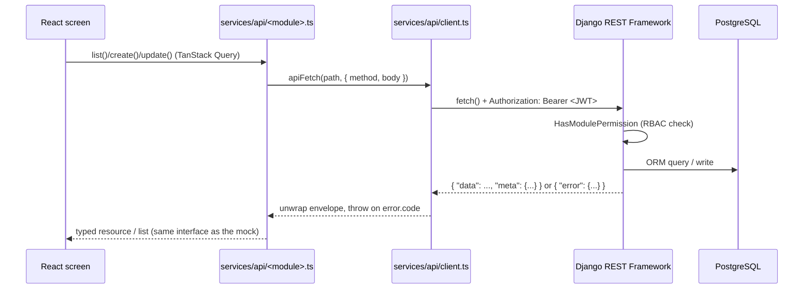

# GreenFlow ERP — Ecowrap Nepal (Frontend)

Mobile-first React front end for a Manufacturing ERP built for a bio-degradable/compostable
plastic packaging manufacturer (Ecowrap Nepal, ISO 17088). Proposal reference
`ETN/PROP/2026/ERP-ECW-001`.

This repository is the **UI layer** for EcoWrap Nepal ERP. Auth, organization, audit and
domain records talk to Django when a live JWT session is available; screens fall back to
typed mock data if the API is unreachable.

> For the full architecture, module-by-module screen breakdown, design system and forms
> conventions, see **[PROJECT_DOCS.md](PROJECT_DOCS.md)**. For the REST contract this UI expects,
> see **[API_DOCS.md](API_DOCS.md)**.

## Current status — what's implemented right now

| Layer | State |
|---|---|
| UI screens & navigation | **Built.** 15+ modules including IRD, AI Analytics, CoA, statements, bank rec, assets, machines, recruitment, performance, report builder. |
| Data | **Hybrid.** Live Django `DomainRecord` APIs when `auth.source === "api"`; otherwise in-memory mocks. |
| Auth | **Live JWT** (`POST /api/v1/auth/login|refresh|logout|me/`) with mock fallback. Roles from `/me`. |
| Organization / audit | **Wired** to Phase A endpoints (company, branches, departments, fiscal years/periods, audit logs). |
| Django backend | Phases A–I Record APIs in [`../Backend`](../Backend). Third-party IRD/OCR/WhatsApp/AI engines need credentials. |

## Roadmap — what happens next

Work proceeds in lockstep with [`Backend/README.md § Phase status`](../Backend/README.md#9-phase-status):

| Next up | Frontend work required | Depends on backend |
|---|---|---|
| 1. Auth | Live login/refresh/me/logout/change-password + envelope unwrap | **Done** (Phase A) |
| 2. Organization/Settings | Company/Branch/Department/Fiscal Year + period close | **Done** (Phase A) |
| 3. CRM & Sales | Wire customers/leads/quotations/orders/invoices | **Done** (Phase B) |
| 4. Purchase & Inventory | Wire PO/GRN/products/stock | **Done** (Phases B–C) |
| 5. Production & Quality | BOM/WO/MRP/QC + Machines tab | **Done** (Phases D–E) |
| 6. Accounting & HR/Payroll | CoA, statements, recruitment, performance, payroll runs | **Done** (Phases F–G) |
| 7. Reports, Workflow, Notifications | Report builder, Excel/PDF, scheduled email | **Done** (Phase H) |
| 8. Compliance/Integrations/AI | IRD queue, WhatsApp/RFID/IoT/backups, i18n, 2FA, AI ask | **Done** (Phase I UI + gateways) |

Each row is live against Django Record APIs; mock data is only used when the API is unreachable.

## Tech stack

React 19 · TypeScript · Vite 7 · TanStack Start/Router (file-based routing) · TanStack Query ·
Zustand · React Hook Form + Zod · Tailwind CSS v4 · shadcn/ui · Recharts · lucide-react.

## Quick start

```bash
bun install
bun run dev      # http://localhost:8080
bun run build    # production build
bun run lint
```

Demo login: `admin@ecowrap.com` / `admin123`, or `manager@` / `sales@` / `purchase@` /
`production@` / `warehouse@` / `qc@` / `hr@ecowrap.com` with `demo123`. Live Django is used when
the API is up (Vite proxies `/api` and `/health` to `http://127.0.0.1:8000`); otherwise mock auth.

### Docker (full stack)

From the repo root (`ERP PLASTIC`):

```bash
docker compose up --build
# Frontend http://localhost:8080  ·  Backend http://localhost:8000/health/
```

See [`../DOCKER.md`](../DOCKER.md). Image targets: `development` (Vite HMR) and `production` (`passenger.cjs`).

## Project structure

```text
src/
  routes/          file-based routes; `_app.*` = authenticated shell
  components/      ui/ (shadcn primitives), layout/, common/ (DataListPage, RecordFormDialog, ...)
  features/        one folder per ERP module, each with mock.ts demo data
  services/api/    client.ts envelope unwrap; auth/organization/audit/records modules
  store/           auth.ts — live JWT with mock fallback
  i18n/            Nepali/English toggle
  constants/        roles + navigation registry
  lib/              cn(), permissions, CSV export, formatters
  styles.css        design tokens (OKLCH green theme, light + dark)
```

Full module list (CRM, Sales, Purchase, Inventory, Warehouse, Production, Quality Control, HR,
Accounting, Reports, Notifications, Audit Logs, Settings) and their routes/sub-screens are
documented in [PROJECT_DOCS.md § Modules and routes](PROJECT_DOCS.md#4-modules-and-routes).

## Roles

`administrator`, `manager`, `sales`, `purchase`, `warehouse`, `production`, `hr`,
`quality_control`, `viewer`. Every screen is gated by `hasRole()`/`usePermission()` in
`src/lib/permissions.ts` — client-side gating is UX only, the Django backend enforces the same
matrix server-side (see `Backend/API_DOCS.md § RBAC model`).

## Connecting the backend

Already wired:

1. `VITE_API_BASE_URL` (default `/api/v1`) and Vite proxy to Django `:8000`.
2. Envelope unwrap + JWT refresh in `src/services/api/client.ts`.
3. `entityService.ts` uses live Record APIs when `isLiveSession()` is true.
4. Auth, organization, audit, and domain `records.ts` paths for ~70 entities.

Live IRD CBMS, OCR vendors, WhatsApp Business and the AI model still need client API keys
(usage fees out of contract). The UI and Record queues are in place.

## Data model & backend interaction

Every mock entity in `src/features/*/mock.ts` is a 1:1 TypeScript mirror of a future Django
model's serialized shape — same field names, same enums — so wiring a screen to the real API is
a data-source swap, not a rewrite. The intended request flow once a module is live:



Key connection points between the two repos:

- **Form schemas → API contract.** `src/features/forms/definitions.ts` already declares the
  target Django `endpoint` for all 28 entities. This is the single source of truth
  `eco-craft-flow/API_DOCS.md` was generated from, and what each backend module's serializer
  fields must match field-for-field.
- **IDs.** Every entity uses a UUID `id`, matching `apps.core.models.BaseModel.id` on the backend
  — no frontend code assumes auto-incrementing integers.
- **Roles.** The 9 roles hard-coded in `src/constants/roles.ts` are exactly the 9 `Role.code`
  values seeded by `Backend/apps/system/management/commands/seed_demo.py`, so swapping mock auth
  for real JWT auth requires no role-mapping logic.
- **Response envelope.** See the reconciliation note above — this is the one shape mismatch that
  must be handled in `client.ts` before any module goes live.

## Development methodology

This project follows the **hybrid Waterfall → Agile/Scrum delivery model** defined in the client
proposal (`ETN/PROP/2026/ERP-ECW-001`, §12 *Implementation Methodology and Project Phases*) —
**not** a Spiral, Butterfly, or pure Waterfall model. Concretely:

1. **Waterfall-style front stage (fixes scope & cost, done once):** Requirement Gathering →
   Business Analysis / Gap-Fit → Design (architecture, ERD, API contract, wireframes) →
   signed-off SRS. This frontend repository *is* the executable output of that Design stage: it
   is effectively the wireframes/UI-kit deliverable turned into a fully working, demonstrable
   click-through prototype ahead of backend integration.
2. **Agile/Scrum-style back stage (iterative, module-by-module):** fixed two-week sprints, each
   with an agreed sprint goal, ending in a recorded staging demo and a written sprint report.
   Nothing is declared "done" until it has passed module testing *and* been demonstrated — the
   same rule this repo follows internally (a module's UI is not considered complete until its
   backend counterpart has models, serializers, permissions and passing tests, per
   `Backend/README.md`).
3. **Verification gates, not opinion:** each of the proposal's three milestones (foundation →
   core modules integrated → full system + compliance) is accepted against a written checklist,
   mirroring how this repo's own phase table above only marks a module "live" once its backend
   dependency is actually built and tested, not just scaffolded.

**Where this repo sits in that lifecycle today:** Design is complete. Development sprints have
wired auth, organization, audit and domain Record APIs (Phases B–I) into the screens. Remaining
go-live work is UAT sign-off, production TLS, client credentials for IRD/OCR/WhatsApp/AI, and
training — see [`Backend/docs/go-live-runbook.md`](../Backend/docs/go-live-runbook.md).

